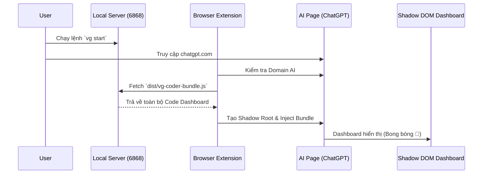
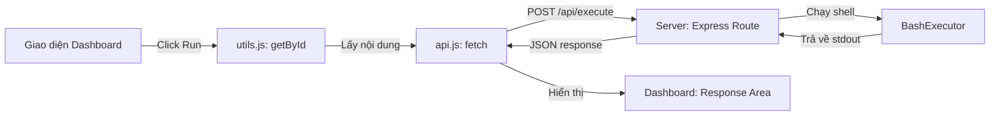

# VG Coder - Project Architecture Guide

Tài liệu này giải thích cách thức hoạt động của hệ thống VG Coder, vai trò của từng thành phần và cách để một lập trình viên mới bắt đầu phát triển tính năng.

---

## 1. Tổng quan hệ thống (System Overview)

VG Coder là một bộ công cụ hỗ trợ lập trình bằng AI, hoạt động dựa trên sự kết hợp của 3 thành phần chính:

1.  **CLI / API Server (Node.js/Express):** Chạy dưới máy cục bộ (Localhost:6868). Nhiệm vụ: Quét mã nguồn, đếm token, thực thi lệnh Terminal và quản lý file.
2.  **Frontend Dashboard (HTML/CSS/JS):** Giao diện người dùng. Được build thành một file duy nhất (`vg-coder-bundle.js`).
3.  **Browser Extension:** "Cầu nối" giúp nhúng Dashboard trực tiếp vào các trang web AI (ChatGPT, Claude) bằng công nghệ **Shadow DOM**.

## 2. Sơ đồ luồng (Flow Diagrams)

### A. Luồng khởi tạo (Initialization Flow)
Khi bạn chạy `vg start` và mở trang ChatGPT:



### B. Luồng thực thi tính năng (Feature Execution)
Ví dụ khi người dùng nhấn nút "Execute Bash":



---

## 3. Các thành phần chi tiết

### 📂 Server (`src/server/`)
*   **`api-server.js`**: Định nghĩa các điểm cuối (Endpoints) cho UI gọi vào.
*   **`project-manager.js`**: Quản lý việc chạy nhiều dự án cùng lúc (Leader/Follower).
*   **`terminal-manager.js`**: Sử dụng `node-pty` để tạo các session Terminal thực trên máy tính.

### 📂 Frontend (`src/server/views/`)
Đây là nơi bạn phát triển tính năng mới.
*   **`js/features/`**: Mỗi tính năng (Git, Terminal, Tree View) nằm trong một file riêng.
*   **`js/utils.js`**: Chứa các helper quan trọng. **Lưu ý:** Tuyệt đối không dùng `document.getElementById`, phải dùng `getById()` vì App chạy trong Shadow DOM.
*   **`js/shadow-entry.js`**: Điểm vào (Entry point) để kết nối Dashboard với môi trường Shadow DOM của Extension.

### 📦 Build System (`gulpfile.js`)
Do Extension không thể tải từng file JS/CSS lẻ từ Localhost vì lý do bảo mật (CORS/CSP), Gulp sẽ:
1. Gom tất cả CSS thành một chuỗi.
2. Nén HTML thành một chuỗi.
3. Bundle toàn bộ JS bằng Webpack.
4. Đóng gói tất cả vào file `dist/vg-coder-bundle.js`.

---

## 4. Event Protocol & Feature System

VG Coder sử dụng **Event-Driven Architecture** để quản lý giao tiếp giữa các component, đặc biệt là bubble menu features. Hệ thống này cho phép:
- ✅ Tách biệt UI và logic xử lý
- ✅ Thêm features mới mà không cần sửa code cũ
- ✅ Giao tiếp cross-context (window, shadow-root, iframe)
- ✅ Test features độc lập

### Thành phần chính

#### 1. Event Protocol (`event-protocol.js`)

Định nghĩa giao thức event chuẩn:

```javascript
// Event format
{
  type: 'vg:paste-run',          // Event type
  source: 'bubble-menu',          // Source component
  target: 'handlers',             // Target component
  payload: { /* data */ },        // Event data
  timestamp: 1234567890,          // Timestamp
  context: 'shadow-root'          // Execution context
}
```

**Event Types:**
- `vg:paste-run` - Paste & Run from Clipboard
- `vg:terminal-new` - Open New Terminal
- `vg:terminal-execute` - Execute command in terminal

#### 2. Event Dispatcher

`EventDispatcher` class quản lý event registration và dispatching:

```javascript
import { globalDispatcher, EVENT_TYPES } from './event-protocol.js';

// Register listener
globalDispatcher.on(EVENT_TYPES.PASTE_RUN, async (event) => {
  console.log('Event received:', event);
  // Handle event
});

// Dispatch event
globalDispatcher.dispatch({
  type: EVENT_TYPES.PASTE_RUN,
  source: 'bubble-menu',
  target: 'handlers',
  payload: { /* data */ }
});
```

#### 3. Feature Registry (`features/bubble-features/`)

Quản lý bubble menu features:

```javascript
// Feature structure
{
  id: 'paste-run',
  icon: '📋',
  label: 'Paste & Run from Clipboard',
  tooltip: 'Paste & Run from Clipboard',
  eventType: EVENT_TYPES.PASTE_RUN,
  permissions: ['clipboard-read'],
  enabled: true,
  order: 1
}
```

### Cách thêm Bubble Menu Feature mới

**Bước 1:** Tạo event type mới trong `event-protocol.js`:

```javascript
export const EVENT_TYPES = {
  // Existing types...
  MY_FEATURE: 'vg:my-feature',  // New event type
};
```

**Bước 2:** Tạo feature definition (`features/bubble-features/my-feature.js`):

```javascript
import { EVENT_TYPES } from '../../event-protocol.js';

export const MyFeature = {
  id: 'my-feature',
  icon: '⚡',
  label: 'My Feature',
  tooltip: 'Do something cool',
  eventType: EVENT_TYPES.MY_FEATURE,
  permissions: [],
  enabled: true,
  order: 3,
};
```

**Bước 3:** Register feature trong `features/bubble-features/index.js`:

```javascript
import { MyFeature } from './my-feature.js';

// Register
featureRegistry.register(MyFeature);
```

**Bước 4:** Add event handler trong `handlers.js`:

```javascript
export function initEventHandlers() {
  // Existing handlers...
  
  // My Feature handler
  globalDispatcher.on(EVENT_TYPES.MY_FEATURE, (event) => {
    console.log('[Handlers] My Feature event:', event);
    // Implement your logic here
  });
}
```

**Bước 5:** Build và test:

```bash
npm run build
vg start
```

Feature sẽ tự động xuất hiện trong bubble menu! 🎉

### Debug Event System

Sử dụng browser console để debug:

```javascript
// Enable debug mode
window.__VG_EVENT_DISPATCHER__.setDebug(true);

// View registered features
console.log(window.__VG_FEATURE_REGISTRY__.getFeatures());

// View event history
console.log(window.__VG_EVENT_DISPATCHER__.getHistory());

// Test dispatch manually
window.__VG_EVENT_DISPATCHER__.dispatch({
  type: 'vg:paste-run',
  source: 'test',
  target: 'handlers',
  payload: {}
});
```

---

## 5. Hướng dẫn phát triển tính năng mới

Nếu bạn muốn thêm tính năng mới (Ví dụ: "Database Manager"):

1.  **Backend:** Thêm Route vào `src/server/api-server.js` để xử lý logic phía máy tính.
2.  **Frontend Markup:** Thêm HTML vào `src/server/views/dashboard.html`.
3.  **Frontend Style:** Tạo file `src/server/views/css/db-manager.css`.
4.  **Frontend Logic:** 
    *   Tạo `src/server/views/js/features/db-manager.js`.
    *   Dùng `import { getById } from '../utils.js'` để lấy element.
    *   Gán hàm vào `window` nếu cần gọi từ HTML (ví dụ: `window.openDB = ...`).
5.  **Đăng ký:** Import và khởi tạo trong `src/server/views/js/main.js`.
6.  **Build:** Chạy `npm run build` để cập nhật file bundle.

---

## 6. Các quy tắc "Sống còn" cho người mới

1.  **Shadow DOM Context:** Dashboard không thể thấy biến của trang web (ChatGPT) và ngược lại. Mọi thao tác DOM của Dashboard phải qua `getById()` hoặc `qs()`.
2.  **API Base:** Luôn sử dụng biến `API_BASE` từ `config.js` khi dùng `fetch`. Nó tự động nhận diện khi nào cần gọi về `localhost:6868`.
3.  **Z-Index:** Bong bóng 🚀 có z-index là `2147483647` để luôn nằm trên cùng. Các modal của bạn nên có z-index thấp hơn mức này một chút.
4.  **No Stdin in Terminal:** Do Shadow DOM chặn một số sự kiện bàn phím, Terminal được thiết kế theo kiểu "Input riêng - Output riêng".

---
Tài liệu này được cập nhật vào tháng 12/2025.
